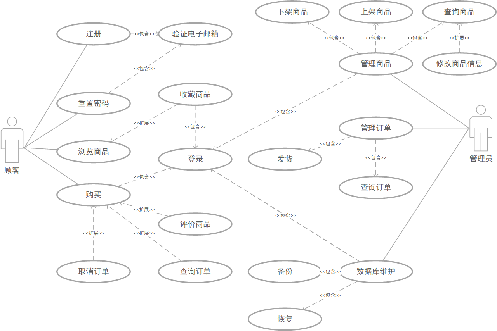

# 用户使用手册
## 快速开始
- 运行环境：JDK1.8、MySQL、Redis
- 部署
  - 测试部署
    1. 导入数据库“flowershop.sql”
    2. 运行`java -jar flowershop.jar`可快速启动项目
    3. 访问localhost:8080，
        - 测试管理员账号：admin@admin.com
        - 测试顾客账号：test@user.com
        - 密码：000000
  - 生产环境部署
    1. 在application.yaml配置smtp邮箱、数据库相关信息
    2. 构建项目mvn compile; mvn package
    3. 前端使用Nginx（apache或IIS）部署并配置反向代理
    4. 后端使用Docker容器化运行

## 使用方法
### 网站管理员
- 登录
    1. 访问网站管理页面。
    2. 输入管理员提供的用户名和密码。
    3. 点击登录按钮进入管理后台。
- 花卉管理
    1. 添加分类：在商品分类界面添加分类。
    2. 添加商品：点击“添加”按钮，输入商品名称、描述、价格等信息，上传商品图片，保存。
    3. 编辑商品：在商品列表中选择需要编辑的花卉，点击“编辑”按钮，修改信息后保存。
    4. 删除商品：选择需要删除的商品，点击“删除”按钮，确认删除。已购买的商品由于销售信息统计需要，暂时无法删除。
    5. 查询商品：商品列表上方的工具栏可按商品名进行查询。
- 订单管理
    1. 查看订单：进入订单管理页面，查看所有订单详情。
    2. 处理订单：选择待处理订单，点击“发货”或“提醒收货”按钮，更新订单状态。
    3. 查询订单：订单列表上方的工具栏可按顾客联系电话、订单状态、收货方式进行查询。
- 用户管理
    1. 查看用户：进入用户管理页面，查看注册用户信息。
    2. 编辑用户：点击用户列表中的“编辑”按钮，修改用户信息后保存。
    3. 删除用户：选择需要删除的用户，点击“删除”按钮，确认删除。
    4. 查询用户：用户列表上方的工具栏可按用户角色、邮箱、用户名进行查询。
- 数据库维护
    1. 备份数据库：点击备份按钮备份数据库到指定位置。
    2. 恢复数据库：在列表中选择待恢复的节点，点击“恢复”。

### 顾客
- 注册与登录
    1. 点击“注册”按钮，填写必要信息后提交。
    2. 登录时输入用户名和密码，点击登录。
    3. 访问网站首页。
- 浏览与购买
    1. 浏览花卉：查看花卉分类找到想要的花卉。
    2. 购买花卉：选择花卉，添加到购物车，点击“立即支付”按钮，填写取货方式和收货信息，选择支付方式，完成购买。
- 订单管理
    1. 查看订单：在我的订单查看自己的订单状态。
    2. 确认收货：收到货之后点击确认收货完成订单。
    3. 取消订单：在订单详情中，选择未处理的订单点击“取消订单”。

---

# 开发人员手册
- 技术选型
    - Spring Boot：快速构建Spring应用程序
    - Spring Data JPA：持久层框架
    - QueryDSL：辅助JPA实现复杂动态查询
    - Spring Security：身份验证
    - MySQL：数据库
    - Redis：缓存中间件
    - Spring Mail：邮件服务
    - Swagger：在线API文档自动生成工具
- 功能设计
    - 用户注册与登录
    - 顾客功能：浏览鲜花商品、将商品添加到购物车、收藏商品、下单购买、查看订单
    - 管理员功能：查看系统和销售基本信息、管理商品、管理订单、管理用户、数据库备份还原
    - 暂未实现功能：物流信息查询、用户修改个人信息
- 接口设计
    - 使用 RESTful API，并且有专门的 Swagger UI 界面进行API的查看和测试
- 安全设计
    - 用户密码加密存储
    - 输入验证和过滤，防止SQL注入和XSS攻击
- 部署规划
    - 前端部署在静态资源服务器Nginx
    - 后端使用Docker容器化部署
- 时序图

- ER图

- 用例图

- 类图-数据库

